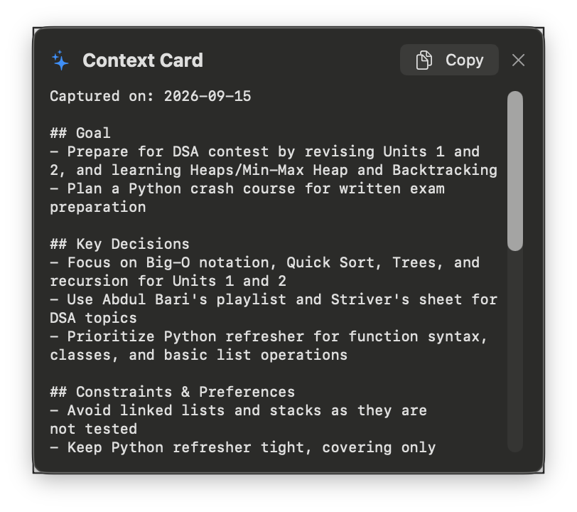

# Context Transfer

A native macOS menu bar app that turns any LLM or app conversation into a portable context card you can paste into a new session to resume work.



[](LICENSE)
[](https://github.com/Shivala-08/context-shifter/actions/workflows/ci.yml)
[](https://www.apple.com/macos/)
[](https://swift.org/)

---

## Features

- **Menu bar only** — no Dock icon, no window on launch (`LSUIElement`)
- **Global capture shortcut** (⌘⇧X by default, re-recordable) with built-in collision check
- **Smart capture** — reads selected text via Accessibility API when available; falls back to synthetic ⌘C; restores original clipboard
- **Exclusion list** — never captures from 1Password, Keychain Access, or any bundle ID you add
- **Floating result panel** — non-activating, near cursor or fixed corner; dismisses on Esc, click-away, or Copy
- **Two interchangeable backends:**
  - **Local (Ollama)** — default, free, private; model list fetched from your Ollama install; explicit 8K context window
  - **Cloud (Anthropic)** — `claude-sonnet-4-6`; your API key stored in Keychain
- **Validation + retry** — malformed model output retried once, then flagged for review instead of silently passing
- **Compression levels** — Full / Balanced / Minimal control how much of the conversation survives into the card; the panel reports the reduction (e.g. `18.4k → 2.1k tokens · 89% smaller`)
- **Launch at login** — toggle in Settings
- **Zero dependencies** — SwiftUI + AppKit, `URLSession` for all HTTP

---

## Quickstart

### Build from source (macOS 13+, Xcode 15+ / Swift 5.9+)

```bash
git clone https://github.com/Shivala-08/context-shifter.git
cd context-shifter
./Scripts/build-app.sh
open ".build/app/Context Transfer.app"
```

> **Rebuild tip:** ad-hoc builds change code identity on every rebuild, and macOS binds the Accessibility grant to that identity. After a rebuild the capture shortcut silently dies until you re-grant. Fix permanently by creating a self-signed code-signing cert once (Keychain Access → Certificate Assistant → Create Certificate → name `ContextTransferDev`, type *Code Signing*), then build with:
> ```bash
> SIGN_IDENTITY="ContextTransferDev" ./Scripts/build-app.sh
> ```

### Download a release

Grab the latest release from [Releases](https://github.com/Shivala-08/context-shifter/releases) — currently source-only (build with the quickstart above); a signed `.dmg` is planned.

---

## How it works

1. **Select** text in any app (browser, editor, chat, notes…)
2. **Press ⌘⇧X** — Context Transfer captures the selection, extracts a structured context card via your chosen backend, and shows a floating panel
3. **Copy** the card and **paste** into your new session/app

The card contains: **Goal**, **Key Decisions**, **Constraints & Preferences**, **Current State**, **Resources & Links** (copied verbatim), **Open Questions** — tight bullets meant as a first message in a fresh session.

### Compression levels

Pick how aggressively conversations are compressed — Settings → *Compression*, or the picker in the paste-in window:

| Level | Behavior |
|---|---|
| **Full** | Keeps the most detail: decision rationale, names, values, exact error messages |
| **Balanced** *(default)* | Drops greetings and filler; keeps every decision, constraint, question, and link |
| **Minimal** | At most 2 short bullets per section — links still copied verbatim |

Every capture reports the reduction: the floating panel and the paste-in window show original vs. card token estimate (e.g. `18.4k → 2.1k tokens · 89% smaller`). Estimates use a ~4 characters-per-token heuristic.

Longer-form design docs (PRD, TRD, build manual) live in [docs/](docs/).

---

## Backends

**Local — Ollama** *(default)* · 100% local, free
Install [Ollama](https://ollama.com), run `ollama serve`, pull a model (e.g. `llama3.2:3b`).

**Cloud — Anthropic** · sent to `api.anthropic.com`, pay per token
Add your API key in Settings (stored in Keychain).

Local is the default. Switch in Settings → Extraction backend.

---

## Contributing

See [CONTRIBUTING.md](CONTRIBUTING.md) for build requirements, coding conventions, and PR process.

---

## Security

See [SECURITY.md](SECURITY.md) for vulnerability reporting. The app transmits data **only** when you explicitly configure a cloud backend.

---

## License

MIT — see [LICENSE](LICENSE).